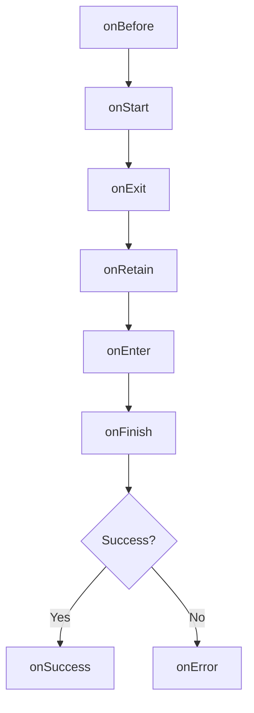

# Transition Hooks

Transition hooks allow you to execute code at specific points during a transition's lifecycle. They provide powerful extension points for authentication, authorization, logging, and more.

## Hook Registry

Hooks are registered using the `IHookRegistry` interface, implemented by both `TransitionService` and `Transition`:

```typescript
export interface IHookRegistry {
  onBefore(criteria: HookMatchCriteria, callback: TransitionHookFn, options?: HookRegOptions): Function;
  onStart(criteria: HookMatchCriteria, callback: TransitionHookFn, options?: HookRegOptions): Function;
  onEnter(criteria: HookMatchCriteria, callback: TransitionStateHookFn, options?: HookRegOptions): Function;
  onRetain(criteria: HookMatchCriteria, callback: TransitionStateHookFn, options?: HookRegOptions): Function;
  onExit(criteria: HookMatchCriteria, callback: TransitionStateHookFn, options?: HookRegOptions): Function;
  onFinish(criteria: HookMatchCriteria, callback: TransitionHookFn, options?: HookRegOptions): Function;
  onSuccess(criteria: HookMatchCriteria, callback: TransitionHookFn, options?: HookRegOptions): Function;
  onError(criteria: HookMatchCriteria, callback: TransitionHookFn, options?: HookRegOptions): Function;
}
```

## Hook Types

### Transition Hooks

From `TransitionHookFn`:

```typescript
export interface TransitionHookFn {
  (transition: Transition): HookResult;
}
```

Used by: `onBefore`, `onStart`, `onFinish`, `onSuccess`, `onError`

### State Hooks

From `TransitionStateHookFn`:

```typescript
export interface TransitionStateHookFn {
  (transition: Transition, state: StateDeclaration): HookResult;
}
```

Used by: `onEnter`, `onRetain`, `onExit`

### Hook Result

From `HookResult`:

```typescript
type HookResult = 
  | boolean              // false cancels transition
  | TargetState          // redirects to new state
  | void                 // continue transition
  | Promise<boolean | TargetState | void>;
```

## Hook Lifecycle Phases



### onBefore

Runs **synchronously** before the transition starts. No resolves have been fetched.

```typescript
transitionService.onBefore(
  { to: 'admin.**' },
  (trans) => {
    if (!authService.isAuthenticated()) {
      // Redirect to login
      return trans.router.stateService.target('login', {
        returnTo: trans.to().name
      });
    }
  }
);
```

<Note>
**Best for:**
- Quick authentication checks
- Synchronous redirects
- Canceling transitions early
</Note>

### onStart

Runs **asynchronously** when the transition starts. Good for async operations.

```typescript
transitionService.onStart(
  { to: 'dashboard' },
  async (trans) => {
    // Show loading spinner
    await loadingService.show();
    
    // Fetch required data
    await preloadDashboardData();
  }
);
```

<Note>
**Best for:**
- Async authentication
- Preloading data
- Showing loading indicators
</Note>

### onExit

Runs when a state is being exited. Receives both transition and the exiting state.

```typescript
transitionService.onExit(
  { exiting: 'editor' },
  (trans, state) => {
    if (editorService.hasUnsavedChanges()) {
      const confirmed = await confirmDialog('Discard changes?');
      if (!confirmed) {
        return false; // Cancel transition
      }
    }
  }
);
```

<Note>
**Best for:**
- Cleanup operations
- Confirmation dialogs
- Saving state before exit
</Note>

### onRetain

Runs when a state is being retained (not exited or entered, but staying active).

```typescript
transitionService.onRetain(
  { retained: 'users' },
  (trans, state) => {
    console.log('Users state retained');
    // Update query parameters or refresh data
  }
);
```

<Note>
**Best for:**
- Updating state when moving between child states
- Refreshing data on parameter changes
</Note>

### onEnter

Runs when a state is being entered.

```typescript
transitionService.onEnter(
  { entering: 'users.detail' },
  (trans, state) => {
    const userId = trans.params().userId;
    analyticsService.trackPageView(`User ${userId}`);
  }
);
```

<Note>
**Best for:**
- Analytics tracking
- Initializing services
- Setting up subscriptions
</Note>

### onFinish

Runs just before the transition completes. Last chance to cancel or redirect.

```typescript
transitionService.onFinish(
  {},
  (trans) => {
    console.log('Transition finishing:', trans.to().name);
  }
);
```

### onSuccess

Runs after the transition successfully completes.

```typescript
transitionService.onSuccess(
  {},
  (trans) => {
    // Hide loading spinner
    loadingService.hide();
    
    // Track successful navigation
    analyticsService.trackPageView(trans.to().name);
  }
);
```

### onError

Runs if the transition fails.

```typescript
transitionService.onError(
  {},
  (trans) => {
    const error = trans.error();
    
    if (error.type === RejectType.ABORTED) {
      console.log('Transition was canceled');
    } else if (error.type === RejectType.ERROR) {
      console.error('Transition error:', error.detail);
      errorService.show(error.detail);
    }
  }
);
```

## Hook Matching Criteria

From `HookMatchCriteria`:

```typescript
export interface HookMatchCriteria {
  /** Match the destination state */
  to?: HookMatchCriterion;
  
  /** Match the original (from) state */
  from?: HookMatchCriterion;
  
  /** Match any state that would be exiting */
  exiting?: HookMatchCriterion;
  
  /** Match any state that would be retained */
  retained?: HookMatchCriterion;
  
  /** Match any state that would be entering */
  entering?: HookMatchCriterion;
}
```

### Criterion Types

From `HookMatchCriterion`:

```typescript
type HookMatchCriterion = 
  | string              // State name or glob
  | IStateMatch         // Function predicate
  | boolean;            // true matches all
```

### String Matching

```typescript
// Exact state name
{ to: 'users.detail' }

// Glob patterns
{ to: 'users.**' }        // Any descendant of users
{ to: '**.detail' }       // Any state ending in .detail
{ entering: 'admin.*' }   // Direct children of admin
```

### Function Matching

```typescript
// Function predicate
{
  to: (state, trans) => {
    return state.data && state.data.requiresAuth === true;
  }
}

// Check transition options
{
  to: (state, trans) => {
    return trans.options().custom?.tracking === true;
  }
}
```

### Match All

```typescript
// Empty object matches all transitions
{}

// Explicit true matches all
{ to: true, from: true }
```

### Combined Criteria

```typescript
// From public to admin
{
  from: 'public.**',
  to: 'admin.**'
}

// Entering any child of users
{
  entering: 'users.*'
}
```

## Hook Options

From `HookRegOptions`:

```typescript
export interface HookRegOptions {
  /** Hook priority (default: 0) */
  priority?: number;
  
  /** Bind 'this' in callback */
  bind?: any;
  
  /** Max invocations before auto-deregister */
  invokeLimit?: number;
}
```

### Priority

Higher priority hooks run first:

```typescript
// Runs first (priority 10)
transitionService.onBefore({}, hookA, { priority: 10 });

// Runs second (priority 0, default)
transitionService.onBefore({}, hookB);

// Runs last (priority -10)
transitionService.onBefore({}, hookC, { priority: -10 });
```

### Bind Context

```typescript
class MyService {
  checkAuth(trans) {
    return this.isAuthenticated(); // 'this' is MyService
  }
}

const service = new MyService();
transitionService.onBefore(
  { to: 'admin.**' },
  service.checkAuth,
  { bind: service }  // Bind 'this'
);
```

### Invoke Limit

```typescript
// Run only once
transitionService.onSuccess(
  { to: 'welcome' },
  showWelcomeMessage,
  { invokeLimit: 1 }
);
// Auto-deregisters after first invocation
```

## Hook Registration

### Global Hooks (TransitionService)

```typescript
// Register globally - affects all transitions
const deregister = router.transitionService.onBefore(
  { to: 'admin.**' },
  requireAuth
);

// Later: remove hook
deregister();
```

### Per-Transition Hooks

```typescript
// Register on specific transition
const trans = $state.go('users');

trans.onStart({}, (t) => {
  console.log('This transition is starting');
});
// Hook only runs for this transition
```

### State Declaration Hooks

Hooks can be defined directly on states:

```typescript
const state = {
  name: 'users.detail',
  
  onEnter: (trans, state) => {
    console.log('Entering users.detail');
  },
  
  onExit: (trans, state) => {
    if (hasUnsavedChanges()) {
      return confirm('Discard changes?');
    }
  },
  
  onRetain: (trans, state) => {
    console.log('users.detail retained');
  }
};
```

## Hook Execution

From `TransitionHook`:

### Synchronous Execution

```typescript
// onBefore hooks run synchronously
transitionService.onBefore({}, (trans) => {
  console.log('Before 1');
});

transitionService.onBefore({}, (trans) => {
  console.log('Before 2');
});

// Output (in same call stack):
// Before 1
// Before 2
```

### Asynchronous Execution

```typescript
// If a hook returns a promise, subsequent hooks wait
transitionService.onStart({}, async (trans) => {
  await delay(1000);
  console.log('Start 1');
});

transitionService.onStart({}, (trans) => {
  console.log('Start 2'); // Waits for Start 1
});
```

### Hook Chaining

From `TransitionHook.invokeHooks()`:

```typescript
// Hooks are chained
static invokeHooks<T>(
  hooks: TransitionHook[], 
  doneCallback: (result?: HookResult) => T
): Promise<any> | T
```

## Common Patterns

### Authentication

```typescript
transitionService.onBefore(
  { 
    to: (state) => state.data?.requiresAuth 
  },
  (trans) => {
    if (!authService.isAuthenticated()) {
      return trans.router.stateService.target('login', {
        returnUrl: trans.to().name,
        params: trans.params()
      });
    }
  },
  { priority: 100 } // Run early
);
```

### Authorization

```typescript
transitionService.onStart(
  {
    to: (state) => state.data?.roles
  },
  async (trans) => {
    const requiredRoles = trans.to().data.roles;
    const user = await trans.injector().getAsync('currentUser');
    
    const hasRole = requiredRoles.some(role => 
      user.roles.includes(role)
    );
    
    if (!hasRole) {
      return trans.router.stateService.target('forbidden');
    }
  }
);
```

### Analytics

```typescript
transitionService.onSuccess({}, (trans) => {
  const toState = trans.to();
  const params = trans.params();
  
  analytics.trackPageView({
    page: toState.name,
    title: toState.data?.title,
    params: params
  });
});
```

### Loading Indicators

```typescript
transitionService.onStart({}, async (trans) => {
  loadingService.show();
});

transitionService.onFinish({}, (trans) => {
  loadingService.hide();
});

transitionService.onError({}, (trans) => {
  loadingService.hide();
});
```

### Unsaved Changes

```typescript
transitionService.onExit(
  { exiting: 'editor' },
  async (trans, state) => {
    if (editorService.isDirty()) {
      const result = await confirmService.show(
        'You have unsaved changes. Discard them?'
      );
      
      if (!result) {
        return false; // Cancel transition
      }
    }
  }
);
```

### Deep Linking with Authentication

```typescript
let returnToAfterLogin: TargetState = null;

transitionService.onBefore(
  { to: (state) => state.data?.requiresAuth },
  (trans) => {
    if (!authService.isAuthenticated()) {
      // Save where user was trying to go
      returnToAfterLogin = trans.targetState();
      
      return trans.router.stateService.target('login');
    }
  }
);

transitionService.onSuccess(
  { to: 'login' },
  (trans) => {
    // After login, return to original destination
    if (returnToAfterLogin) {
      const target = returnToAfterLogin;
      returnToAfterLogin = null;
      $state.go(target.name(), target.params());
    }
  }
);
```

## Best Practices

<AccordionGroup>
  <Accordion title="Use onBefore for sync checks">
    ```typescript
    // Good: Fast, synchronous
    onBefore({ to: 'admin.**' }, (trans) => {
      if (!isAuthenticated) return $state.target('login');
    });
    
    // Avoid: Slow async in onBefore
    onBefore({}, async (trans) => {
      await checkAuthWithServer(); // Use onStart instead
    });
    ```
  </Accordion>
  
  <Accordion title="Use priorities wisely">
    ```typescript
    // High priority for critical checks
    onBefore({ to: '**' }, checkAuth, { priority: 100 });
    
    // Default priority for normal hooks
    onStart({}, loadData);
    
    // Low priority for optional features
    onSuccess({}, trackAnalytics, { priority: -100 });
    ```
  </Accordion>
  
  <Accordion title="Clean up hook registrations">
    ```typescript
    // Component lifecycle
    class MyComponent {
      deregister: Function;
      
      constructor() {
        this.deregister = transitionService.onStart({}, this.handler);
      }
      
      onDestroy() {
        this.deregister(); // Clean up
      }
    }
    ```
  </Accordion>
  
  <Accordion title="Return promises for async operations">
    ```typescript
    onStart({}, async (trans) => {
      // Transition waits for this
      await loadCriticalData();
    });
    ```
  </Accordion>
</AccordionGroup>

## Next Steps

<CardGroup cols={2}>
  <Card title="Transitions" icon="arrows-turn-right" href="/concepts/transitions">
    Understand the transition lifecycle
  </Card>
  
  <Card title="States" icon="circle-nodes" href="/concepts/states">
    Define onEnter/onExit in states
  </Card>
  
  <Card title="URLs & Parameters" icon="link" href="/concepts/urls-and-parameters">
    Access parameters in hooks
  </Card>
  
  <Card title="Views" icon="eye" href="/concepts/views">
    Hook into view loading
  </Card>
</CardGroup>
