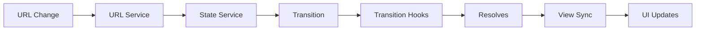

# UI-Router Core Architecture

UI-Router Core provides a state-based routing framework built around several key architectural components that work together to manage application navigation and state.

## Core Components

The [`UIRouter`](/api/uirouter) class is the main entry point and container for all routing services:

```typescript
export class UIRouter {
  /** Provides services related to ui-view synchronization */
  viewService = new ViewService(this);

  /** An object that contains global router state, such as the current state and params */
  globals: UIRouterGlobals = new UIRouterGlobals();

  /** A service that exposes global Transition Hooks */
  transitionService: TransitionService = new TransitionService(this);

  /** Provides services related to the URL */
  urlService: UrlService = new UrlService(this);

  /** Provides a registry for states, and related registration services */
  stateRegistry: StateRegistry = new StateRegistry(this);

  /** Provides services related to states */
  stateService = new StateService(this);
}
```

### Key Services

<CardGroup cols={2}>
  <Card title="State Registry" icon="folder-tree" href="/concepts/states">
    Manages state registration and hierarchy
  </Card>
  
  <Card title="State Service" icon="route" href="/concepts/states">
    API for state transitions and queries
  </Card>
  
  <Card title="Transition Service" icon="arrows-turn-right" href="/concepts/transitions">
    Manages state transition lifecycle and hooks
  </Card>
  
  <Card title="URL Service" icon="link" href="/concepts/urls-and-parameters">
    Handles URL routing and synchronization
  </Card>
  
  <Card title="View Service" icon="eye" href="/concepts/views">
    Pairs ui-view components with view configurations
  </Card>
</CardGroup>

## Architectural Principles

### State-Based Routing

UI-Router uses **states** instead of URLs as the primary routing mechanism. States can:

- Have URLs (optional)
- Nest hierarchically
- Define views, resolves, and parameters
- Be abstract (non-navigable placeholders)

### State Tree

States are organized in a hierarchical tree structure. Each state:

- Has a unique name (e.g., `"home"`, `"users.detail"`)
- Can have a parent state (implicit from name or explicit)
- Inherits properties from parent states

See [State Tree](/concepts/state-tree) for details.

### Transitions

A **transition** represents movement from one state to another. During a transition:

1. States are **exited** (leaving current states)
2. States are **retained** (staying active)
3. States are **entered** (activating new states)

See [Transitions](/concepts/transitions) for details.

### Hierarchical Views

Views can be nested inside other views, creating a hierarchical component structure that mirrors the state tree.

See [Views](/concepts/views) for details.

## Data Flow



### Typical Navigation Flow

1. **Navigation trigger** - User action, URL change, or API call
2. **Target state creation** - `StateService` creates a [`TargetState`](/api/target-state)
3. **Transition creation** - `TransitionService` creates a [`Transition`](/api/transition)
4. **Hook execution** - Transition hooks run in phases (onBefore, onStart, onEnter, etc.)
5. **Resolve fetching** - Asynchronous data is fetched
6. **State activation** - States are entered/exited
7. **View synchronization** - `ViewService` updates ui-view components
8. **Completion** - Transition promise resolves

## State Lifecycle

### StateObject Structure

States are represented internally as [`StateObject`](/api/state-object) instances:

```typescript
export class StateObject {
  /** The parent StateObject */
  public parent: StateObject;
  
  /** The name used to register the state */
  public name: string;
  
  /** A compiled URLMatcher which detects when the state's URL is matched */
  public url: UrlMatcher;
  
  /** The parameters for the state, built from the URL and params declaration */
  public params: { [key: string]: Param };
  
  /** The views for the state */
  public views: { [key: string]: _ViewDeclaration };
  
  /** A list of Resolvable objects. The internal representation of resolve */
  public resolvables: Resolvable[];
}
```

### Registration

States are registered with the [`StateRegistry`](/api/state-registry):

```typescript
const state = {
  name: 'users',
  url: '/users',
  component: UsersComponent,
  resolve: {
    users: (UserService) => UserService.list()
  }
};

router.stateRegistry.register(state);
```

## URL Management

The [`UrlService`](/concepts/urls-and-parameters) manages:

- URL synchronization with the browser
- URL rule matching
- Parameter encoding/decoding
- URL generation from states

## Plugin System

UI-Router supports plugins to extend functionality:

```typescript
class MyPlugin implements UIRouterPlugin {
  name = 'myPlugin';
  
  constructor(router: UIRouter, options: any) {
    router.transitionService.onStart({}, (trans) => {
      // Custom logic
    });
  }
}

router.plugin(MyPlugin);
```

## Next Steps

<CardGroup cols={2}>
  <Card title="States" icon="circle-nodes" href="/concepts/states">
    Learn about state declarations and configuration
  </Card>
  
  <Card title="State Tree" icon="folder-tree" href="/concepts/state-tree">
    Understand hierarchical state organization
  </Card>
  
  <Card title="Transitions" icon="arrows-turn-right" href="/concepts/transitions">
    Explore the transition lifecycle
  </Card>
  
  <Card title="Hooks" icon="hook" href="/concepts/hooks">
    Hook into the transition lifecycle
  </Card>
</CardGroup>
