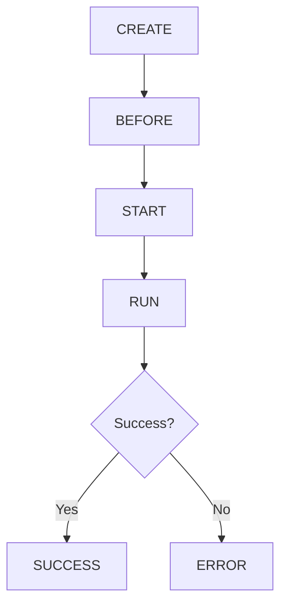

# Transitions

A **transition** represents the process of moving from one state to another in UI-Router. The [`Transition`](/api/transition) class encapsulates all contextual information about this movement.

## Transition Class

From [`Transition`](/api/transition):

```typescript
export class Transition implements IHookRegistry {
  /** A unique identifier for the transition */
  $id: number;
  
  /** A reference to the UIRouter instance */
  router: UIRouter;
  
  /** Promise resolved/rejected based on transition outcome */
  promise: Promise<any>;
  
  /** Indicates if the transition was successful */
  success: boolean;
}
```

## Creating Transitions

Transitions are typically created through the [`StateService`](/api/state-service):

### Using `go()`

```typescript
// Convenience method with sensible defaults
const trans = $state.go('users.detail', { userId: 123 });

// Returns a TransitionPromise
trans.transition; // The Transition object
trans.then(state => {
  console.log('Transitioned to:', state.name);
});
```

From `StateService.go()`:

```typescript
go(to: StateOrName, params?: RawParams, options?: TransitionOptions): TransitionPromise {
  const defautGoOpts = { relative: this.$current, inherit: true };
  const transOpts = defaults(options, defautGoOpts, defaultTransOpts);
  return this.transitionTo(to, params, transOpts);
}
```

### Using `transitionTo()`

```typescript
// Low-level method for more control
const trans = $state.transitionTo('users.detail', 
  { userId: 123 },
  { 
    reload: true,
    inherit: false,
    notify: false
  }
);
```

## Transition Options

From `TransitionOptions`:

```typescript
export interface TransitionOptions {
  /** Update URL in location bar (true, false, or "replace") */
  location?: boolean | 'replace';
  
  /** State to be relative from */
  relative?: string | StateDeclaration | StateObject;
  
  /** Inherit parameter values from current params */
  inherit?: boolean;
  
  /** Force states to reload */
  reload?: boolean | string | StateDeclaration | StateObject;
  
  /** Custom data for hooks */
  custom?: any;
  
  /** Cancel active transition (default: true) */
  supercede?: boolean;
}
```

### Options Examples

```typescript
// Replace browser history entry
$state.go('users', {}, { location: 'replace' });

// Don't update URL
$state.go('modal', {}, { location: false });

// Force reload of current state
$state.go($state.current, {}, { reload: true });

// Reload from a specific parent state
$state.go('users.detail', { id: 456 }, { reload: 'users' });

// Don't inherit current parameters
$state.go('search', { query: 'new' }, { inherit: false });
```

## Transition Lifecycle

Transitions execute through several distinct phases:



### Lifecycle Phases

From `TransitionHookPhase`:

```typescript
enum TransitionHookPhase {
  CREATE,   // Transition is created
  BEFORE,   // Before transition starts
  RUN,      // During transition execution
  SUCCESS,  // After successful completion
  ERROR,    // After transition error
}
```

### Phase Details

<Steps>
  <Step title="CREATE">
    The transition is instantiated. onCreate hooks run synchronously.
    
    ```typescript
    transitionService.onCreate({}, (transition) => {
      console.log('Transition created:', transition.$id);
    });
    ```
  </Step>
  
  <Step title="BEFORE">
    The transition hasn't started yet. onBefore hooks run synchronously.
    No resolves have been fetched. Good for authentication checks.
    
    ```typescript
    transitionService.onBefore({ to: 'admin.**' }, (trans) => {
      if (!authService.isAuthenticated()) {
        return trans.router.stateService.target('login');
      }
    });
    ```
  </Step>
  
  <Step title="START">
    Transition is starting. onStart hooks run asynchronously.
    Eager resolves are fetched during this phase.
    
    ```typescript
    transitionService.onStart({}, async (trans) => {
      await loadingService.show();
    });
    ```
  </Step>
  
  <Step title="RUN">
    States are being exited, retained, and entered. Hooks run in order:
    1. onExit hooks (for exiting states)
    2. onRetain hooks (for retained states)
    3. onEnter hooks (for entering states)
    4. onFinish hooks (just before completion)
    
    ```typescript
    transitionService.onExit({ exiting: 'users.**' }, (trans) => {
      console.log('Exiting users area');
    });
    ```
  </Step>
  
  <Step title="SUCCESS or ERROR">
    Transition completed. onSuccess or onError hooks run.
    
    ```typescript
    transitionService.onSuccess({}, (trans) => {
      analytics.trackPageView(trans.to().name);
    });
    
    transitionService.onError({}, (trans) => {
      console.error('Transition failed:', trans.error());
    });
    ```
  </Step>
</Steps>

## TreeChanges

The `TreeChanges` object describes which states are affected:

```typescript
export interface TreeChanges {
  /** The path of nodes being transitioned from */
  from: PathNode[];
  
  /** The path of nodes being transitioned to */
  to: PathNode[];
  
  /** Nodes that remain active */
  retained: PathNode[];
  
  /** Nodes being deactivated */
  exiting: PathNode[];
  
  /** Nodes being activated */
  entering: PathNode[];
}
```

### Example: TreeChanges

```typescript
// Transition from 'app.users.list' to 'app.settings.profile'
transitionService.onStart({}, (trans) => {
  const tc = trans.treeChanges();
  
  console.log('From:', tc.from.map(n => n.state.name));
  // ['', 'app', 'app.users', 'app.users.list']
  
  console.log('To:', tc.to.map(n => n.state.name));
  // ['', 'app', 'app.settings', 'app.settings.profile']
  
  console.log('Retained:', tc.retained.map(n => n.state.name));
  // ['', 'app']
  
  console.log('Exiting:', tc.exiting.map(n => n.state.name));
  // ['app.users', 'app.users.list']
  
  console.log('Entering:', tc.entering.map(n => n.state.name));
  // ['app.settings', 'app.settings.profile']
});
```

## Transition Context

### Accessing State Information

From [`Transition`](/api/transition):

```typescript
transitionService.onEnter({ entering: '**' }, (trans) => {
  // From state
  const fromState = trans.from();  // StateDeclaration
  const $from = trans.$from();     // StateObject (internal)
  
  // To state
  const toState = trans.to();      // StateDeclaration
  const $to = trans.$to();         // StateObject (internal)
  
  // Target state
  const target = trans.targetState(); // TargetState
});
```

### Accessing Parameters

From `Transition.params()`:

```typescript
transitionService.onStart({}, (trans) => {
  // To parameters (default)
  const toParams = trans.params();
  const toParams2 = trans.params('to');
  
  // From parameters
  const fromParams = trans.params('from');
  
  // Only changed parameters
  const changed = trans.paramsChanged();
  console.log('Changed params:', changed);
});
```

### Dependency Injection

From `Transition.injector()`:

```typescript
transitionService.onEnter({ entering: 'users.detail' }, (trans) => {
  // Get resolved data
  const injector = trans.injector();
  const user = injector.get('user');
  
  // Get async (if not yet resolved)
  const userPromise = injector.getAsync('user');
  
  // Get from specific state
  const parentData = trans.injector('users').get('usersList');
  
  // Get from exiting states
  const exitingData = trans.injector(null, 'from').get('data');
});
```

## Transaction Model

UI-Router uses a **transaction-based** approach to transitions:

### Atomic Transitions

Transitions are atomic - they either fully succeed or fully fail:

```typescript
transitionService.onEnter({ entering: 'step3' }, (trans) => {
  // If this fails, the entire transition is aborted
  if (!canProceedToStep3()) {
    return false; // Cancels transition
  }
});
```

### Transition Superseding

New transitions supersede old ones:

```typescript
// Start transition to 'users'
const trans1 = $state.go('users');

// Immediately start transition to 'settings'
// This supersedes trans1
const trans2 = $state.go('settings');

await trans1; // Rejects with 'Superseded' error
await trans2; // Resolves successfully
```

To prevent superseding:

```typescript
$state.go('modal', {}, { supercede: false });
// This transition will be rejected if another is in progress
```

## Transition Redirects

Transitions can be redirected:

```typescript
transitionService.onStart({ to: 'home' }, (trans) => {
  // Redirect to home.dashboard
  return trans.router.stateService.target('home.dashboard');
});
```

From `Transition.redirect()`:

```typescript
redirect(targetState: TargetState): Transition {
  // Creates a new transition
  // Preserves resolve data where possible
  // Handles infinite redirect prevention
}
```

## Dynamic Transitions

From `Transition.dynamic()`:

A transition is **dynamic** when no states enter/exit but dynamic parameters change:

```typescript
const state = {
  name: 'search',
  url: '/search?query',
  params: {
    query: { dynamic: true }
  }
};

// This is a dynamic transition
$state.go('search', { query: 'new value' });
// No components reload, but params change
```

## Ignored Transitions

From `Transition.ignored()`:

A transition is **ignored** if:
- No states enter/exit
- No parameters change

```typescript
// Already at 'users' with page: 1
$state.go('users', { page: 1 });
// This transition is ignored (no change)
```

## Error Handling

From `Transition.error()`:

```typescript
$state.go('invalid').catch(error => {
  if (error.type === RejectType.INVALID_STATE) {
    console.error('Invalid state');
  } else if (error.type === RejectType.ABORTED) {
    console.error('Transition aborted');
  } else if (error.type === RejectType.SUPERSEDED) {
    console.log('Superseded by another transition');
  }
});
```

### Default Error Handler

Set a global error handler:

```typescript
$state.defaultErrorHandler(error => {
  if (error.type !== RejectType.IGNORED) {
    errorLoggingService.log(error);
  }
});
```

## Best Practices

<AccordionGroup>
  <Accordion title="Always handle transition promises">
    ```typescript
    // Good
    $state.go('users').catch(error => {
      console.error('Navigation failed:', error);
    });
    
    // Avoid
    $state.go('users'); // Unhandled rejection
    ```
  </Accordion>
  
  <Accordion title="Use hooks for cross-cutting concerns">
    ```typescript
    // Authentication
    transitionService.onBefore({ to: state => state.data?.requiresAuth }, (trans) => {
      if (!authService.isAuthenticated()) {
        return trans.router.stateService.target('login');
      }
    });
    ```
  </Accordion>
  
  <Accordion title="Return promises from hooks to wait for async operations">
    ```typescript
    transitionService.onStart({}, async (trans) => {
      // Transition waits for this
      await loadPreferences();
    });
    ```
  </Accordion>
  
  <Accordion title="Use dynamic parameters for UI state">
    ```typescript
    params: {
      sortBy: { value: 'name', dynamic: true },
      page: { value: 1, dynamic: true }
    }
    // Changes don't cause component reload
    ```
  </Accordion>
</AccordionGroup>

## Next Steps

<CardGroup cols={2}>
  <Card title="Hooks" icon="hook" href="/concepts/hooks">
    Learn about transition hooks in detail
  </Card>
  
  <Card title="States" icon="circle-nodes" href="/concepts/states">
    Understand state declarations
  </Card>
  
  <Card title="URLs & Parameters" icon="link" href="/concepts/urls-and-parameters">
    Work with URL parameters
  </Card>
  
  <Card title="Views" icon="eye" href="/concepts/views">
    Update views during transitions
  </Card>
</CardGroup>
